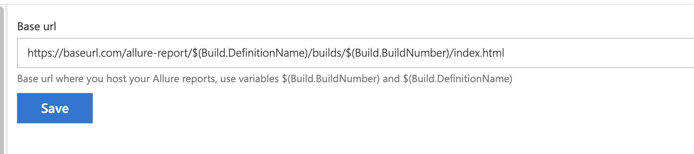

This extension allows you to generate and view Allure test reports right from the Visual Studio Team Services interface.

This extension is a fork from ivang.

**The extension supports both DefinitionName & BuildNumber as URL parameters in order to allow multi-pipelines usage.**

See configuration sample below


**Please note** that due to some limitation in the current version of Team Services API the Allure Generate Build Step will only generate the Allure report and save it as a build artifact. To enable "Open Allure Report" option you will need to add additional build step to publish the report somewhere. For instance you can create a simple Azure Web App (or use github pages) and upload reports there using Build Task extension like [FTP Upload](https://marketplace.visualstudio.com/items?itemName=januskamphansen.ftpupload-task). You website should support HTTPS.

**Please note** If you use Azure Website or IIS in general some file types used by Allure are not enabled by default. Please, add mimetypes as shown below to your web.config in order to enable support of .json and .woff file types.

```xml
<configuration>
    <system.webServer>
        <staticContent>
            <mimeMap fileExtension=".json" mimeType="application/json" />
            <mimeMap fileExtension=".woff" mimeType="application/x-font-woff" />
     </staticContent>
    </system.webServer>
</configuration> 
```

When you have your website up and running we will use url like [BaseUrl] to open a report for the corresponding build. You will need to set BaseUrl property on the Allure settings page in the Project settings:



## Why to use Allure

There are lots of cool testing frameworks for different programming languages. Unfortunately only few of them can provide good representation of test execution output. Allure is an open-source framework designed to create test execution reports clear to everyone in the team.

## How it works

Allure is based on standard xUnit results output but adds some supplementary data. Any report is generated in two steps. During **test execution** (first step) a small library called **adapter** attached to testing framework saves information about executed tests to XML files. We already provide adapters for popular Java, PHP, Ruby, Python, Scala and C# test frameworks.

During **report generation** (second step) XML files are transformed to HTML report. This can be done with command line tool, plugin for CI or build tool. See [examples](https://github.com/allure-examples) and [documentation](https://github.com/allure-framework/allure-core/wiki) for more details.
